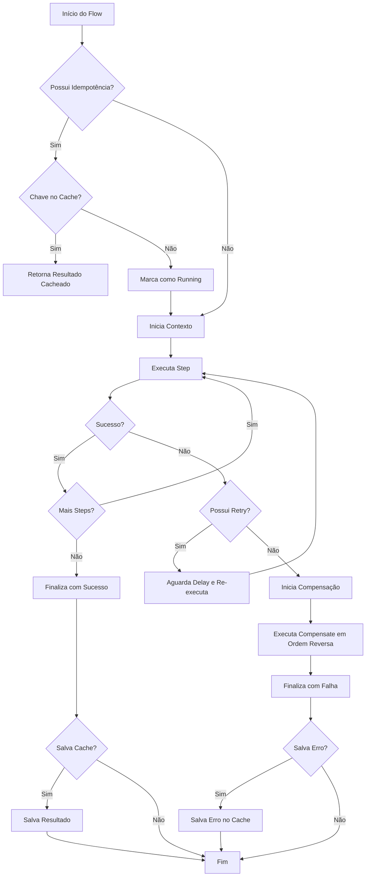
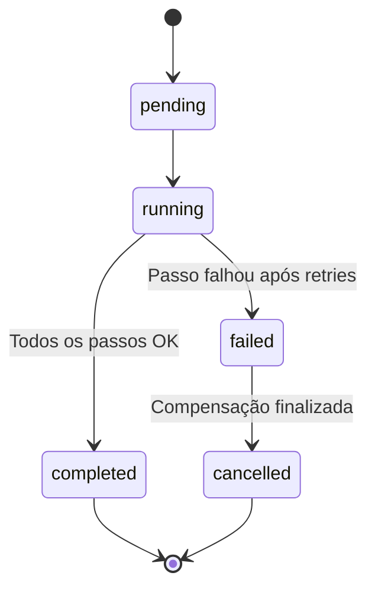

# LocalFlow

LocalFlow é um orquestrador de workflows leve e flexível para Node.js e TypeScript. Ele permite definir sequências de passos (steps) com suporte nativo a retries, timeouts, compensação (sagas) e idempotência.

## Características

- 🚀 **Leve e Rápido**: Sem dependências externas pesadas.
- 🛡️ **Robusto**: Tratamento de erros integrado com retries e timeouts.
- 🔄 **Sagas/Compensação**: Reverte passos executados com sucesso se algo falhar adiante.
- 🆔 **Idempotência**: Garante que a mesma operação não seja executada múltiplas vezes.
- 📝 **TypeScript First**: Totalmente tipado para uma melhor experiência de desenvolvimento.

## Instalação

```bash
npm install localflow
```

## Uso Básico

```typescript
import { create } from 'localflow';

const flow = create<{ userId: string }>('user-signup')
  .step('validate-input', (ctx) => {
    if (!ctx.input.userId) throw new Error('Invalid User ID');
  })
  .step('create-db-record', async (ctx) => {
    // Lógica para criar registro no banco
    ctx.set('dbId', '12345');
  })
  .step('send-welcome-email', async (ctx) => {
    const dbId = ctx.get<string>('dbId');
    // Lógica para enviar email
  });

const result = await flow.run({ userId: 'abc' });
console.log(result.status); // 'completed'
```

## Funcionalidades Avançadas

### Retries e Timeouts

```typescript
flow.step('external-api', async (ctx) => {
  // Chamada de API instável
}, {
  retries: 3,
  retryDelayMs: 1000,
  timeoutMs: 5000
});
```

### Compensação (Sagas)

Se um passo falhar, o LocalFlow executa as funções de compensação de todos os passos anteriores que foram concluídos com sucesso, em ordem reversa.

```typescript
flow
  .step('charge-credit-card', async (ctx) => {
    await api.charge();
  }, {
    compensate: async (ctx) => {
      await api.refund();
    }
  })
  .step('provision-service', async (ctx) => {
    throw new Error('Provisioning failed');
  });
// Ao falhar no segundo passo, o refund() do primeiro será executado.
```

### Idempotência

O LocalFlow suporta persistência de idempotência em memória (padrão) ou em backends externos como Redis e DynamoDB.

#### Em Memória (Default)

```typescript
import { createIdempotencyStore } from 'localflow';

const store = createIdempotencyStore();
const flow = create('payment-flow', { idempotency: store });

const result = await flow.run(data, {
  key: 'order-123',
  ttlMs: 3600000 // 1 hora
});
```

#### Redis

Para usar o Redis, você precisa instalar o pacote `redis` como dependência.

```typescript
import { createClient } from 'redis';
import { redisIdempotencyStore } from 'localflow';

const redis = createClient();
await redis.connect();

const store = redisIdempotencyStore(redis);
const flow = create('payment-flow', { idempotency: store });
```

#### DynamoDB

Para usar o DynamoDB, você precisa instalar o pacote `@aws-sdk/client-dynamodb` e `@aws-sdk/lib-dynamodb` como dependências.

```typescript
import { DynamoDBClient } from '@aws-sdk/client-dynamodb';
import { dynamoIdempotencyStore } from 'localflow';

const client = new DynamoDBClient({});
const store = dynamoIdempotencyStore(client, {
  tableName: 'my-idempotency-table'
});
const flow = create('payment-flow', { idempotency: store });
```

## Fluxo de Execução



## Estados do Fluxo



## Documentação de API

Acesse o JSDoc gerado no código para detalhes sobre cada classe e método.

---
Desenvolvido com ❤️ para fluxos locais eficientes.
