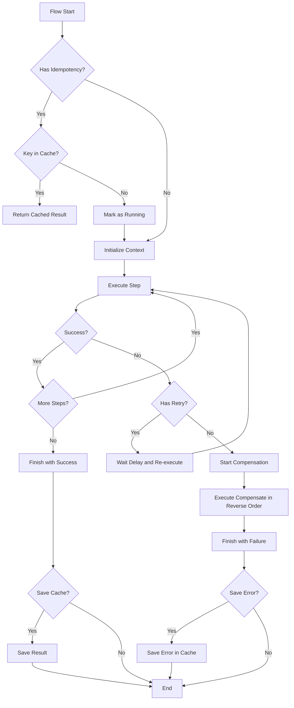
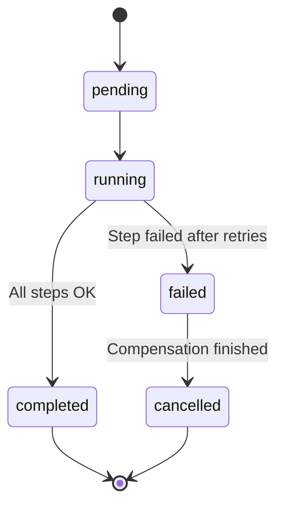

# LocalFlow

LocalFlow is a lightweight and flexible workflow orchestrator for Node.js and TypeScript. It allows you to define sequences of steps with native support for retries, timeouts, compensation (sagas), and idempotency.

## Features

- 🚀 **Lightweight and Fast**: No heavy external dependencies.
- 🛡️ **Robust**: Integrated error handling with retries and timeouts.
- 🔄 **Sagas/Compensation**: Reverts successfully executed steps if something fails later.
- 🆔 **Idempotency**: Ensures that the same operation is not executed multiple times.
- 📝 **TypeScript First**: Fully typed for a better developer experience.

## Installation

```bash
npm install localflow
```

## Basic Usage

```typescript
import { create } from 'localflow';

const flow = create<{ userId: string }>('user-signup')
  .step('validate-input', (ctx) => {
    if (!ctx.input.userId) throw new Error('Invalid User ID');
  })
  .step('create-db-record', async (ctx) => {
    // Logic to create record in the database
    ctx.set('dbId', '12345');
  })
  .step('send-welcome-email', async (ctx) => {
    const dbId = ctx.get<string>('dbId');
    // Logic to send email
  });

const result = await flow.run({ userId: 'abc' });
console.log(result.status); // 'completed'
```

## Advanced Features

### Retries and Timeouts

```typescript
flow.step('external-api', async (ctx) => {
  // Unstable API call
}, {
  retries: 3,
  retryDelayMs: 1000,
  timeoutMs: 5000
});
```

### Compensation (Sagas)

If a step fails, LocalFlow executes the compensation functions of all previously successfully completed steps, in reverse order.

```typescript
flow
  .step('charge-credit-card', async (ctx) => {
    await api.charge();
  }, {
    compensate: async (ctx) => {
      await api.refund();
    }
  })
  .step('provision-service', async (ctx) => {
    throw new Error('Provisioning failed');
  });
// If the second step fails, the refund() of the first will be executed.
```

### Execução Paralela

Você pode executar vários steps em paralelo utilizando o método `.parallel()`.

```typescript
flow.parallel('parallel-block', [
  {
    name: 'send-email',
    fn: async () => { /* ... */ }
  },
  {
    name: 'log-event',
    fn: async () => { /* ... */ }
  }
], {
  failFast: true // Opcional: Se qualquer um falhar, o bloco inteiro falha imediatamente
});
```

### Idempotency

LocalFlow supports idempotency persistence in memory (default) or external backends like Redis and DynamoDB.

#### In-Memory (Default)

```typescript
import { createIdempotencyStore } from 'localflow';

const store = createIdempotencyStore();
const flow = create('payment-flow', { idempotency: store });

const result = await flow.run(data, {
  key: 'order-123',
  ttlMs: 3600000 // 1 hour
});
```

#### Redis

To use Redis, you need to install the `redis` package as a dependency.

```typescript
import { createClient } from 'redis';
import { redisIdempotencyStore } from 'localflow';

const redis = createClient();
await redis.connect();

const store = redisIdempotencyStore(redis);
const flow = create('payment-flow', { idempotency: store });
```

#### DynamoDB

To use DynamoDB, you need to install the `@aws-sdk/client-dynamodb` and `@aws-sdk/lib-dynamodb` packages as dependencies.

```typescript
import { DynamoDBClient } from '@aws-sdk/client-dynamodb';
import { dynamoIdempotencyStore } from 'localflow';

const client = new DynamoDBClient({});
const store = dynamoIdempotencyStore(client, {
  tableName: 'my-idempotency-table'
});
const flow = create('payment-flow', { idempotency: store });
```

## Execution Flow



## Flow States



## API Documentation

Access the generated JSDoc in the code for details on each class and method.

---
Developed with ❤️ for efficient local flows.
